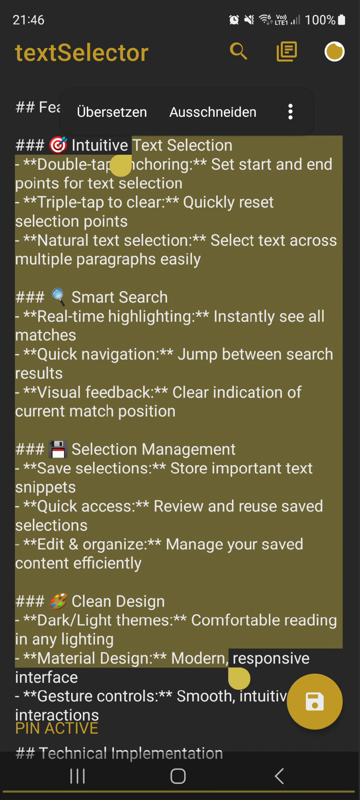
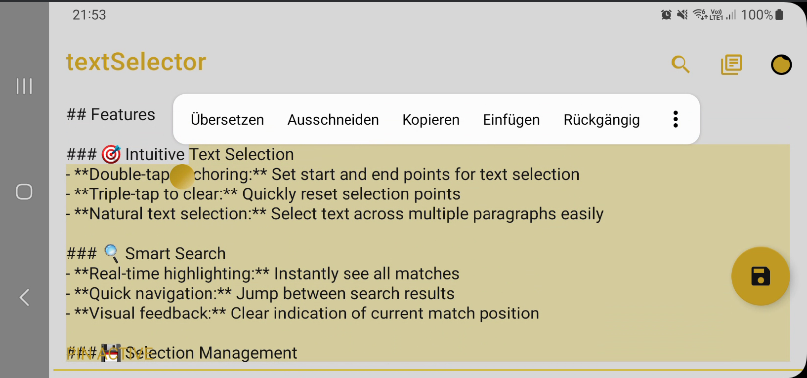
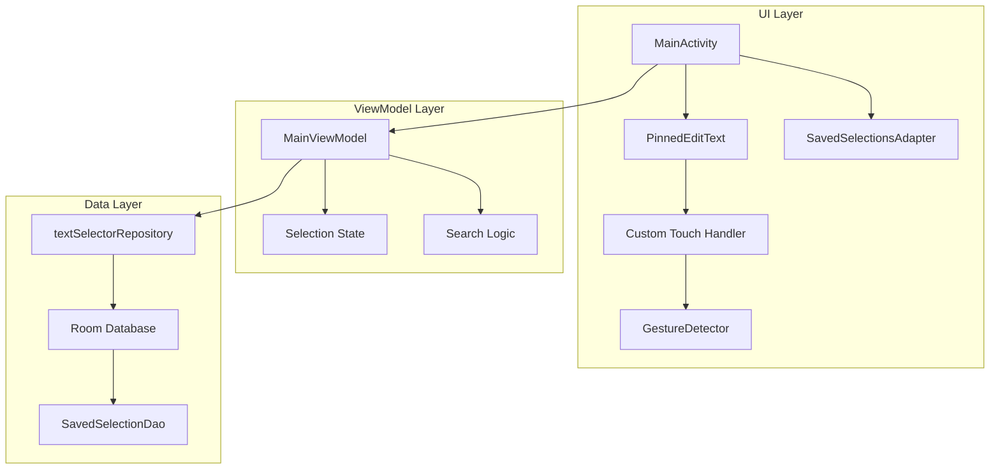

# textSelector

textSelector enhances text selection on Android by implementing PC-like selection behavior. Double-tap to set selection points and easily select large portions of text - similar to Shift+Click functionality on desktop computers.

## Features

### 🎯 Natural Selection Behavior
- Double-tap anchoring for selection points
- Triple-tap to clear selection
- Seamless multi-paragraph selection
- Visual selection markers

### 🔍 Smart Search
- Real-time match highlighting
- Quick result navigation
- Search progress tracking

### 💾 Selection Management
- Local storage for important snippets
- Fast access to saved content
- Edit and organize capabilities

### 🎨 Modern Design
- Light/Dark theme support
- Material Design 3 components
- Gesture-driven interactions

## Technical Implementation

textSelector demonstrates modern Android development practices:

### Core Components
- **PinnedEditText:** Custom EditText implementation with:
  - Gesture recognition for selection
  - Selection state management
  - Search result highlighting
  - Visual marker rendering

- **State Management:**
  - MVVM architecture with LiveData
  - Coroutines for async operations
  - Room for persistent storage

- **UI Components:**
  - Material Design 3 theme
  - Adaptive layouts
  - Dynamic color support

## Usage

1. **Text Selection**
   - Double-tap to set anchor points
   - Select across paragraphs
   - Triple-tap to clear

2. **Search**
   - Use toolbar search
   - Navigate between matches
   - See match position

3. **Manage Selections**
   - Save important snippets
   - Quick access via library
   - Edit saved content

## Contributing
Contributions to textSelector are welcome! Please submit a pull request for any proposed changes or additions. All contributions must comply with the Custom Non-Commercial, Contribution-Based License outlined in the [LICENSE](LICENSE.md) file.

### Contributor License Agreement (CLA)
By contributing, you agree to the terms outlined in the [CLA](CLA.md). This agreement ensures that all contributions can be used in any future version of the project, including potential commercial versions. Please read the CLA before submitting your pull request.

## License
Licensed under a Custom Non-Commercial, Contribution-Based License.

### Key Points:
- **Private, non-commercial use** permitted
- **Modifications** must be contributed back
- **Commercial use** requires explicit permission
- **Contact:** [Tobias Fankhauser](https://www.linkedin.com/in/tobias-fankhauser)

### Third-Party Licenses
This project uses various third-party libraries that are subject to their own licenses:
- **Kotlin & Android SDK**: Apache License 2.0
- **Material Components**: Apache License 2.0
- **AndroidX Libraries**: Apache License 2.0

Please check each library's specific license terms for their usage restrictions.

## Support
If you find textSelector useful, consider supporting its development:

[Buy me a token!](https://buymeacoffee.com/TobiFank)

## Acknowledgments
- Material Design Components for modern UI elements
- The Android Open Source Project
- All contributors who have helped improve textSelector
